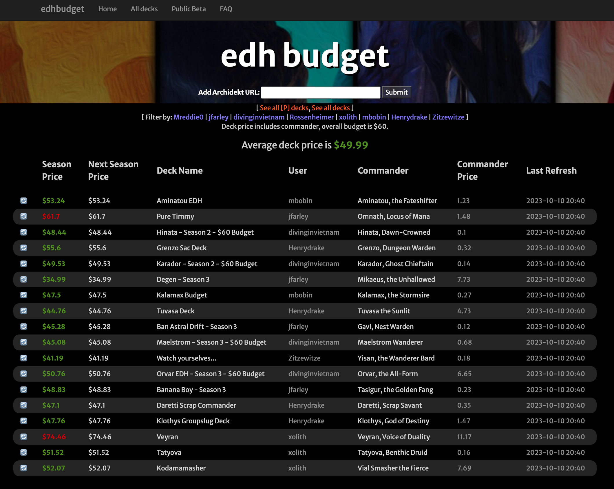

[edhbudget](https://edhbudget.com) is an easy way track and compare the values of the decks in your edh playgroup.

# Features
- Stable deck prices: Each year is split into 3 seasons (January - April, May - August, October - December). The app displays a price for the current season and the next season.
- Prices updated daily
- Price breakdown for each card in a deck
- Archidekt support

